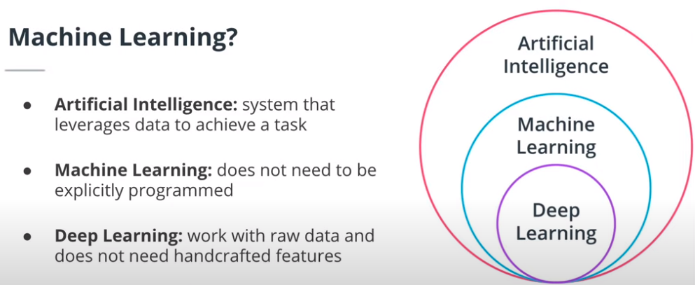
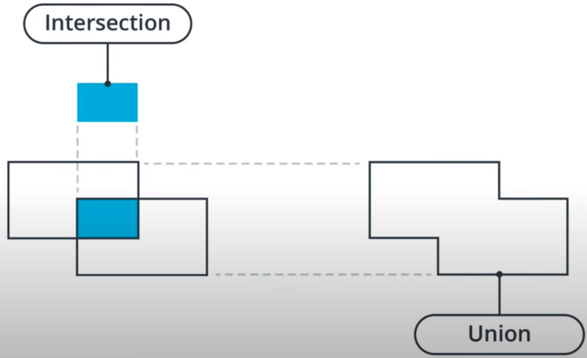

# Object Detection Metrics

This is a study repo where, as seen during the [Udacity Self-Driving Car Engineer Nanodegree](https://www.udacity.com/course/self-driving-car-engineer-nanodegree--nd0013), I'll put some class notes and concepts I got during the course and also an example of how to identify, calculate and analyze metrics in a Object Detection problem.

## Concepts

### What is Machine Learning

{width=70%}


* **Artificial Intelligence (AI)**: a system that leverages information from its environment to make decision. For example, a video game bot.
* **Machine Learning (ML)**: an AI that does not need to be explicitly programmed and instead learns from data. For example, a spam classification algorithm.
* **Deep Learning (DL)**: a subset of ML algorithms that do not require handcrafted features and can work with raw data. For example, an object detection algorithm with a convolutional neural network.

### Classification Metrics

Knowing that each Machine Learning / Deep Learning problem requires its own metrics, for **Classificaion, Semantic Segmentation and Object Detection** problems, it is usually considered the following metrics:

* **Precision**: Of the elements classified as a particular class, how many did we get right? For example, we classified 6 images as containing burgers and only 5 of them actually contain a burger. The precision is 5/6.


```math
PRECISION = {TP \over TP + FP}
```
<center>WHERE: TP = True Positive, FP = False Positive, TN = True Negative, FN = False Negative</center>

* **Recall:** The number of images classified correctly divided by the total number of images. For example, we have 40 images of burgers and we classified 15 of them correctly. The recall is 15/40.

```math
RECALL = {TP + FN \over TP}
```

* **Accuracy:** (Only for classification problems) The number of correctly classified images over the total number of images. It will tell us how good our algorithm is on predicting the right classification task.

 ```math
ACCURACY = {TP + FN + TN + FP\over TP + TN}
```

### How to define True Positive in the context of Object Detection?

By using the IOU concept (Interception over Union) which is defined as the ratio of the intersection of the object detection's bounding boxes and the union of these bounding boxes (like the image bellow):

{width=50%}

An IOU of 0.5 between a ground-truth bounding box and a detected bounding box is a common threshold to qualify the detection as a true positive.  
